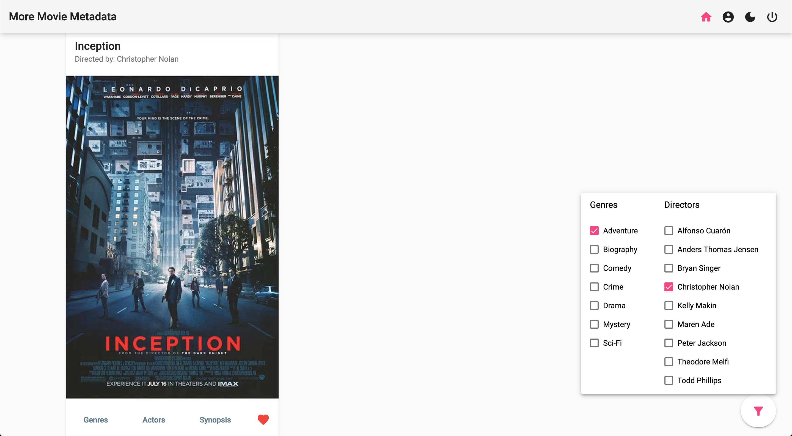

# MORE MOVIE METADATA - Angular Client

Welcome to the Angular user client for my <a href="https://github.com/hannesdonel/MMM">MORE MOVIE METADATA API</a>. This fully responsive single page application will provide you graphically appealing with access to information about different movies, directors, and genres stored on a MongoDB database. The design is following the <a href="https://material.io/">Material Design Guidelines</a> from Google.
It's possible to sign up to create a unique list of favorite movies.

<a href="https://hannesdonel.github.io/MMM-client-Angular/">Use the app.</a>

## Technologies

- TypeScript, HTML, SCSS
- Angular
    - light and dark mode using Angular's color palettes
    - template and reactive forms with comprehensive validation
- RxJS

## Functionality

#### Registration
- Allows new users to register (username, password, email, birthday)

#### Login
- Log in with a username and password

#### Main
- Returns a list of all movies (each listed item with an image, title, genres, directors, actors and
description)
- Sorting and filtering
- Ability to select a movie for more details

#### Single movie
- Returns data (description, genres, directors, actors, image) about a single movie
- Add or remove movie to list of favorites

#### Genres and directors
- Returns data about a genre or director, with a name and description/bio
- Displays example movies

#### Profile
- Update user info (username, password, email, date of birth)
- User deregistration
- Display and alter list of favorite movies

#### Single movie and all movies
- Allow users to see which actors star in which movies

## Get started

I'm using npm throughout this tutorial, you can of course use another package manager.

#### Prerequisites
- Node.js

        npm install node@lts

#### Development server

Run `ng serve` or `npm start`for a dev server. Navigate to `http://localhost:8080/`. The app will automatically reload if you change any of the source files.

#### Build

Run `npm run build` to build the project. The build artifacts will be stored in the `dist/` directory. The base-href is set to https://hannesdonel.github.io/MMM-client-Angular/.
